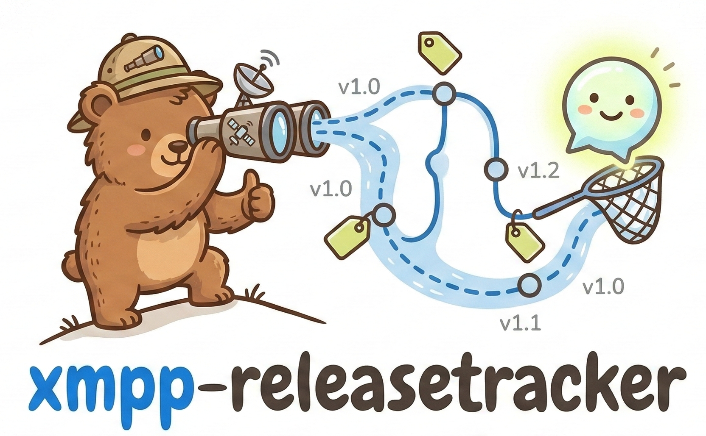

# xmpp-releasetracker



A Go bot that watches repositories on GitHub, GitLab, and Gitea for new releases or tags, and announces them via XMPP — both to MUC rooms and to individual users.

## Features

- Monitors **GitHub**, **GitLab** (self-hosted or gitlab.com), and **Gitea** instances
- Tracks individual repos, user starred repos, organizations, and GitLab groups
- Sends notifications to **XMPP MUC rooms** and **direct messages**
- Persists seen releases in SQLite — no duplicate announcements after a restart
- Silent on first run: snapshots current releases without announcing them
- Optional pre-release filtering per entry or globally
- Pure Go, no CGO required

## Requirements

- Go 1.25+
- An XMPP account for the bot

## Installation

```bash
git clone https://github.com/RoiArthurB/xmpp-releasetracker.git
cd xmpp-releasetracker
go build -o xmpp-releasetracker .
```

## Configuration

Copy the example config and edit it:

```bash
cp config.yml.example config.yml
$EDITOR config.yml
```

### Full reference

```yaml
xmpp:
  jid: "bot@example.com"        # Bot's JID
  password: "secret"
  server: "example.com:5222"    # Optional. Defaults to the domain part of the JID on port 5222
  muc_nick: "releasebot"        # Nickname used when joining MUC rooms

backends:
  github:
    token: "ghp_xxx"            # Optional, but strongly recommended to avoid rate limiting
  gitlab:
    - url: "https://gitlab.com"
      token: "glpat-xxx"
    - url: "https://gitlab.example.com"   # Self-hosted instance
      token: "glpat-yyy"
  gitea:
    - url: "https://gitea.example.com"
      token: "xxx"

database:
  path: "./releasetracker.db"   # Default: ./releasetracker.db

interval: 3600                  # Seconds between poll cycles. Default: 3600
verbose: false                  # Log warnings for repos without releases (404s). Default: false. Optional
skip_prereleases: false         # Skip pre-releases globally. Default: false. Optional

# Optional. Receives notifications for every tracked repo.
# Per-entry notify lists are additive on top of this.
# Duplicates between the two are ignored automatically.
default_notify:
  - jid: "you@example.com"
    type: direct
  - jid: "general@conference.example.com"
    type: muc

tracking:
  - ...                         # See "Tracking entries" below
```

### Tracking entries

Each entry in `tracking` describes what to watch and where to send notifications.

All entries accept an optional `skip_prereleases` field that overrides the global setting for that entry:

```yaml
- type: repo
  backend: gitea
  slug: "owner/repo"
  skip_prereleases: true        # only stable releases for this repo
  notify:
    - jid: "room@conference.example.com"
      type: muc
```

> **Backend support:** `skip_prereleases` currently filters pre-releases on **Gitea** only. GitHub's Atom feed and GitLab's API do not expose a pre-release flag, so the option has no effect on those backends.

#### Single repository

```yaml
- type: repo
  backend: github               # github, gitlab, or gitea
  slug: "owner/repo"
  notify:
    - jid: "room@conference.example.com"
      type: muc
    - jid: "user@example.com"
      type: direct
```

For GitLab and Gitea, add an `instance` field to select which configured instance to use:

```yaml
- type: repo
  backend: gitlab
  slug: "group/project"
  instance: "https://gitlab.example.com"
  notify:
    - jid: "room@conference.example.com"
      type: muc
```

#### User starred repositories

Watches all repositories starred by a given user:

```yaml
- type: user_stars
  backend: github
  username: "someuser"
  notify:
    - jid: "room@conference.example.com"
      type: muc
```

#### Organization repositories (GitHub / Gitea)

Watches all repositories belonging to an organization:

```yaml
- type: org
  backend: github
  org: "golang"
  notify:
    - jid: "room@conference.example.com"
      type: muc
```

#### Group repositories (GitLab)

Watches all projects inside a GitLab group:

```yaml
- type: group
  backend: gitlab
  group: "gitlab-org"
  instance: "https://gitlab.com"
  notify:
    - jid: "room@conference.example.com"
      type: muc
```

### Notification targets

| Field  | Values              | Description                        |
|--------|---------------------|------------------------------------|
| `jid`  | any JID             | Destination address                |
| `type` | `muc` or `direct`   | MUC room or direct (1:1) message   |

## Usage

```bash
./xmpp-releasetracker -config config.yml
```

The `-config` flag defaults to `config.yml` in the current directory.

## Docker

### Build and run manually

```bash
docker build -t xmpp-releasetracker .
docker run -d \
  --name releasetracker \
  --restart unless-stopped \
  -v "$(pwd)/config.yml:/etc/xmpp-releasetracker/config.yml:ro" \
  -v releasetracker-data:/data \
  xmpp-releasetracker
```

### Docker Compose

```bash
cp config.yml.example config.yml
$EDITOR config.yml        # fill in your credentials
docker compose up -d
```

To follow the logs:

```bash
docker compose logs -f
```

To rebuild after a code change:

```bash
docker compose up -d --build
```

### Database path in containers

The container exposes `/data` as a volume for persistent storage. Set the database path in your `config.yml` accordingly:

```yaml
database:
  path: "/data/releasetracker.db"
```

The config file itself is mounted read-only at `/etc/xmpp-releasetracker/config.yml` and never written to by the bot.

## Notification format

```
[Github] owner/repo — v1.2.3 "Release name"
https://github.com/owner/repo/releases/tag/v1.2.3

Release notes here, capped at 10 lines / 2000 characters...
```

Messages use [XEP-0393 Message Styling](https://xmpp.org/extensions/xep-0393.html) for the bold headline (`*…*`).

### Inline images

The bot attaches the repository owner's avatar as an inline image using [XEP-0385 Stateless Inline Media Sharing (SIMS)](https://xmpp.org/extensions/xep-0385.html). Support varies by client:

| Client | Image displayed? |
|--------|-----------------|
| MonocleChat (iOS/Android) | ✅ Yes |
| Gajim | ❌ No |
| Movim | ❌ No (sanitizes external `` tags) |

**Note:** XEP-0385 has _Deferred_ status. Contributions to improve client compatibility are welcome!

## How it works

On each poll cycle the tracker:

1. Resolves the list of repos for each tracking entry (direct slug, or expanded from stars/org/group)
2. Fetches the latest releases from the backend API (up to 5 per repo)
3. Checks each release against the `seen_releases` table in SQLite
4. Announces unseen releases published within the last 7 days, in chronological order
5. Records every release as seen so it is never announced again

**First run / new repo:** all currently known releases are recorded silently without announcement. This prevents flooding when a repo is first added to the config.

## Project structure

```
main.go
config.yml.example
Dockerfile
compose.yml
internal/
  config/       # YAML loading and validation
  store/        # SQLite persistence (seen releases)
  backend/
    backend.go  # Backend interface and Release type
    github/     # GitHub Atom feed
    gitlab/     # GitLab REST API
    gitea/      # Gitea REST API
  tracker/      # Polling loop and notification logic
  xmpp/         # XMPP connection, MUC join, message sending
```

## License

MIT
